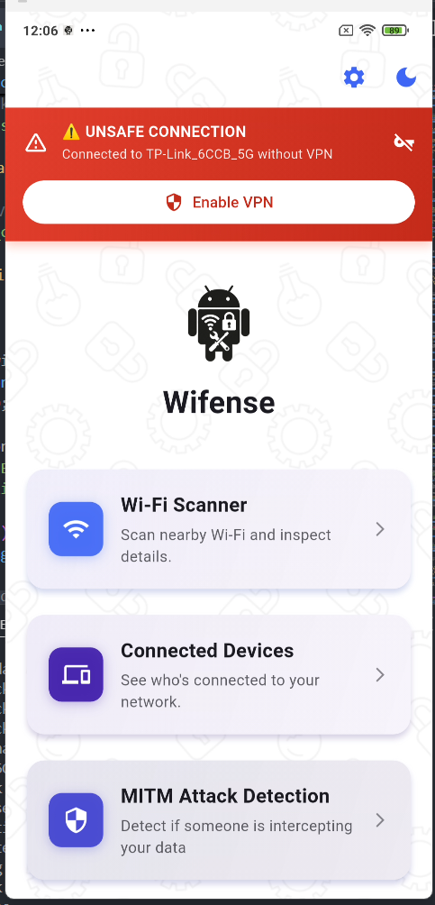
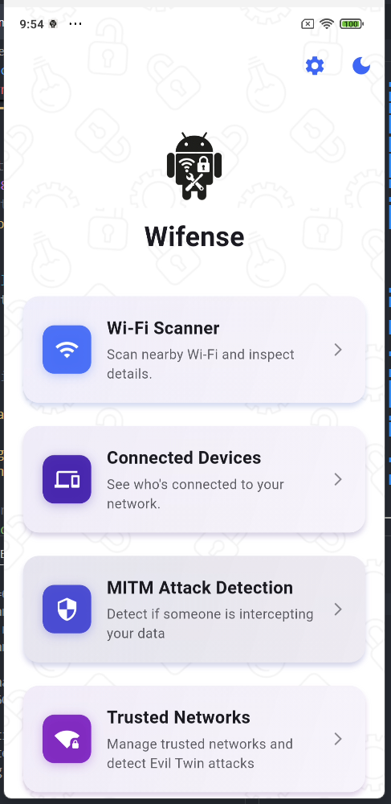
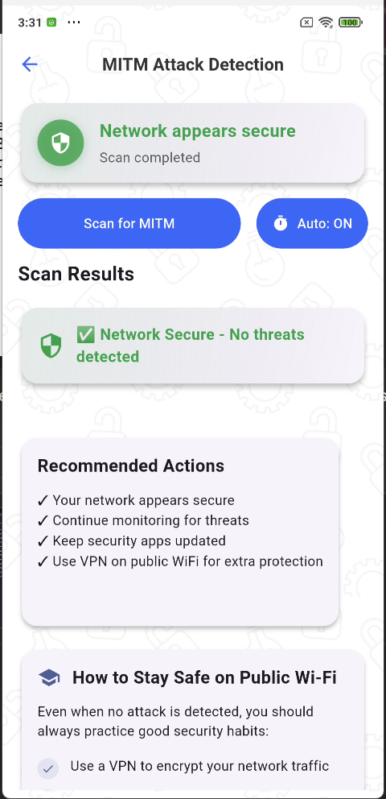
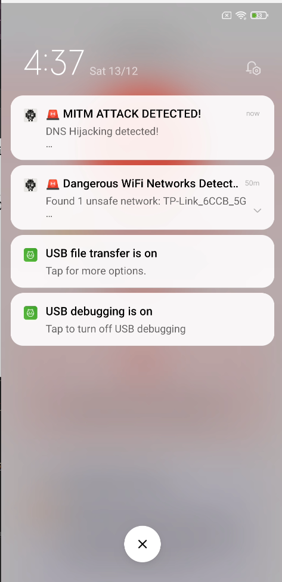

# WiFense - WiFi Security Scanner

<div align="center">
  
  **Advanced Android WiFi Security Scanner**
  
  Detecting MITM Attacks & Evil Twin Networks
</div>

## 📱 About

WiFense is a sophisticated Android WiFi security scanner designed to detect Man-in-the-Middle (MITM) attacks and Evil Twin networks. The application employs multiple detection methods to provide comprehensive network security analysis.

## ✨ Key Features

- **ARP Spoofing Detection** - Monitors ARP table for suspicious entries
- **DNS Hijacking Detection** - Validates DNS responses to detect manipulation
- **SSL Certificate Validation** - Verifies SSL certificates to prevent MITM attacks
- **Gateway Latency Analysis** - Detects abnormal network latency patterns
- **Evil Twin Detection** - Identifies fake WiFi access points
- **Real-time Monitoring** - Continuous background network monitoring
- **Scan History & Export** - Save and export scan results (PDF/CSV)
- **Trusted Networks** - Manage whitelist for known safe networks

## 🛠️ Technology Stack

- **Framework**: Flutter & Kotlin
- **Platform**: Android (API 21+)
- **Authentication**: Firebase Authentication
- **Database**: Local storage with SharedPreferences
- **Network**: Android Network APIs, WiFi Manager
- **Security**: SSL/TLS validation, ARP table analysis

## 📊 Detection Methods

### 1. ARP Spoofing Detection
Monitors the ARP table to detect duplicate MAC addresses or suspicious entries that indicate ARP poisoning attacks.

### 2. DNS Hijacking Detection
Performs DNS queries and validates responses to ensure DNS integrity and detect tampering.

### 3. SSL Certificate Validation
Validates SSL certificates from the gateway to prevent MITM attacks using fake certificates.

### 4. Gateway Latency Analysis
Measures and analyzes network latency patterns to detect abnormal delays that might indicate traffic interception.

### 5. Evil Twin Detection
Scans for duplicate SSIDs with different BSSIDs to identify fake access points.

## 🚀 Installation & Setup

### Prerequisites
- Android Studio Arctic Fox or newer
- Flutter SDK (3.0+)
- Android device with API level 21+
- WiFi permissions enabled

### Setup Steps

1. **Clone the repository**
```bash
git clone https://github.com/affiqadha/Wifi-Security-Scanner.git
cd Wifi-Security-Scanner
```

2. **Install dependencies**
```bash
flutter pub get
```

3. **Configure Firebase** (if using authentication)
- Add `google-services.json` to `android/app/`
- Configure Firebase project

4. **Build & Run**
```bash
flutter run
```

## 📱 Usage

1. **Initial Setup**: Login or create an account
2. **Start Scan**: Tap the scan button to begin security analysis
3. **Review Results**: Check detection results and threat levels
4. **Add Trusted Networks**: Mark safe networks to skip future alerts
5. **Export Reports**: Save scan history in PDF or CSV format

## 🧪 Testing & Validation

WiFense has been tested and validated through:

- Manual testing with various WiFi network configurations
- Detection algorithm validation against simulated MITM scenarios
- False positive rate optimization (especially for mobile router environments)
- Performance testing on multiple Android devices
- Real-world network security testing using Kali Linux tools

**Key Testing Areas:**
- ARP spoofing detection accuracy
- DNS hijacking response validation
- SSL certificate verification
- Latency analysis threshold tuning
- Evil Twin network identification

## 📝 Project Information

**Final Year Project (FYP)**
- **Institution**: Universiti Kuala Lumpur Malaysian Institute of Information Technology (UniKL MIIT)
- **Program**: Computer System Security
- **Academic Year**: 2024/2025
- **Project Type**: Mobile Security Application

## 👨‍💻 Author

**Affiqadha**
- GitHub: [@affiqadha](https://github.com/affiqadha)
- Email: affiqadha@gmail.com
- Institution: UniKL MIIT

## 📄 License

This project is part of a Final Year Project for academic purposes.

## 🙏 Acknowledgments

- UniKL MIIT - Computer System Security Program
- Project Supervisor
- Android Security Documentation
- Flutter Community

## 📸 Screenshots

<p align="center">
  
  
</p>

<p align="center">
  
  
</p>

**⚠️ Disclaimer**: WiFense is an educational tool developed for FYP purposes. Use for unauthorized network testing is prohibited.